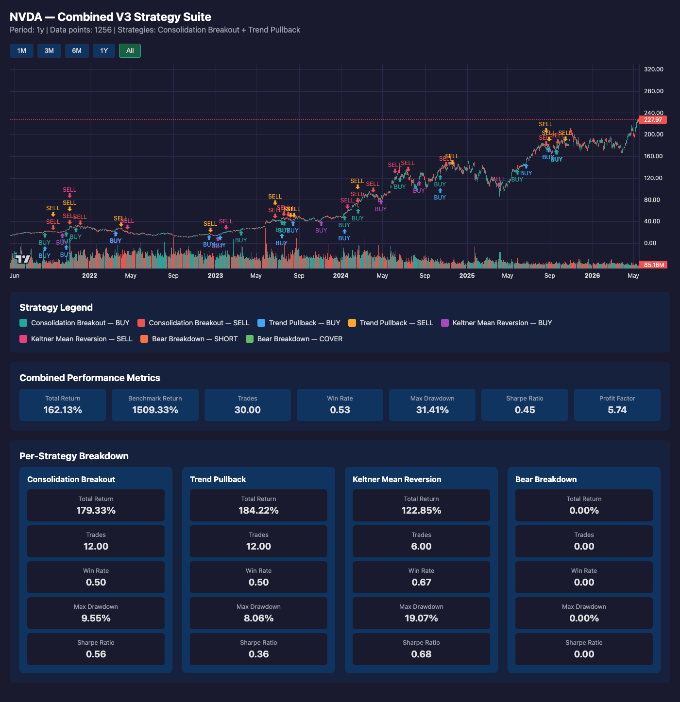
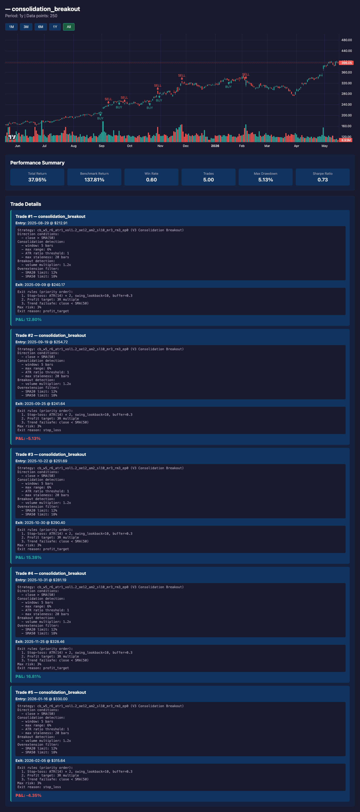
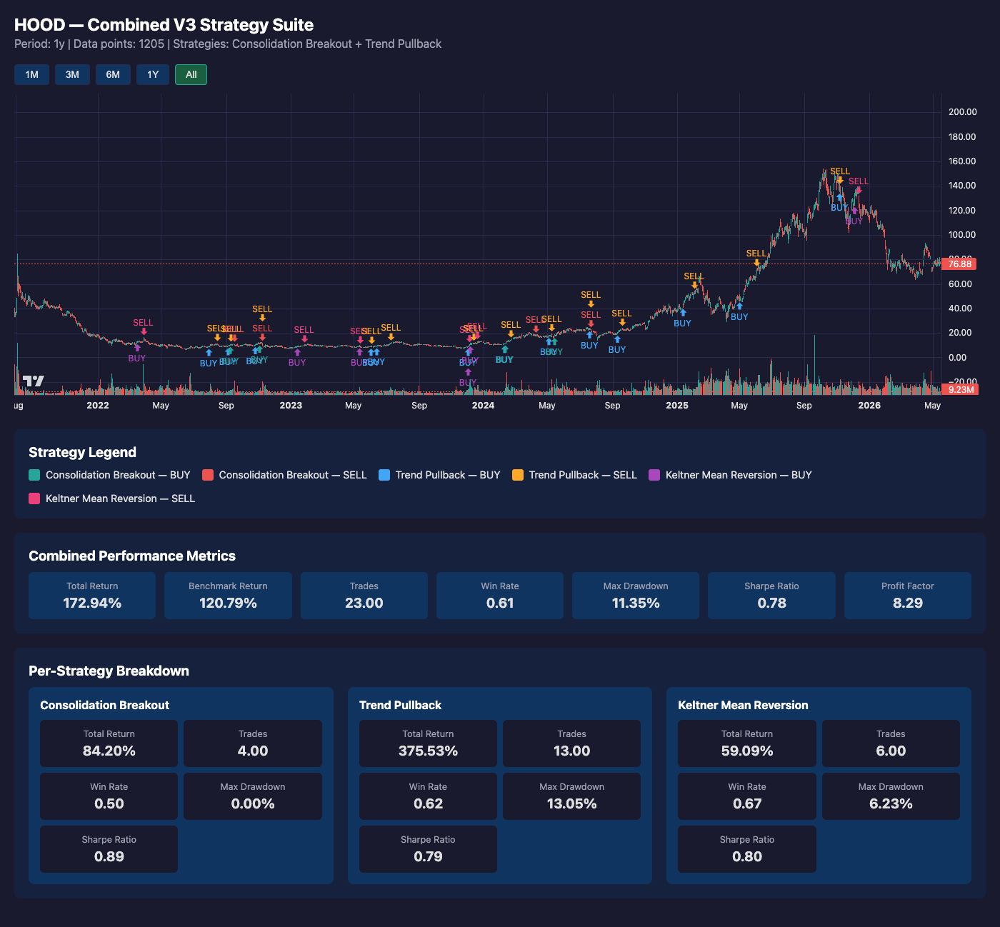
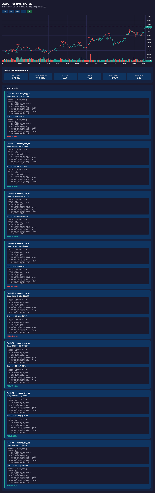
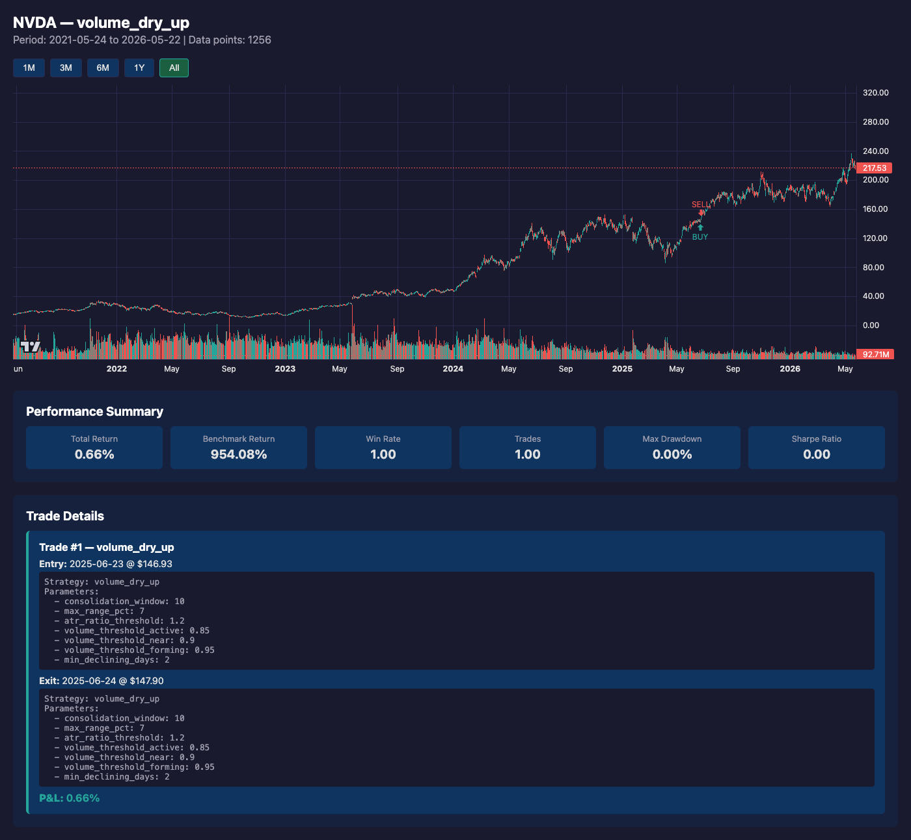
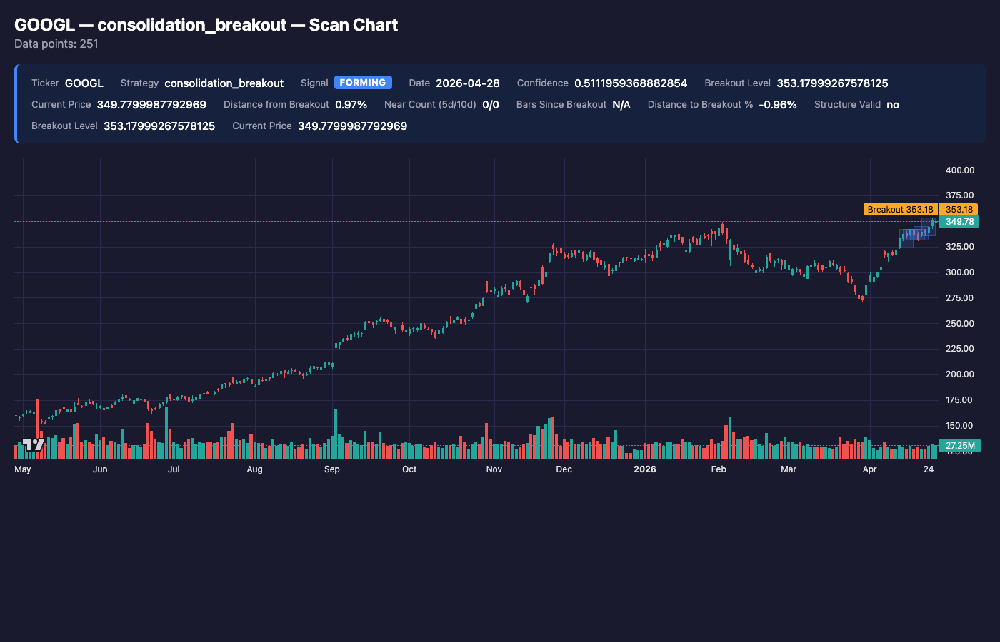
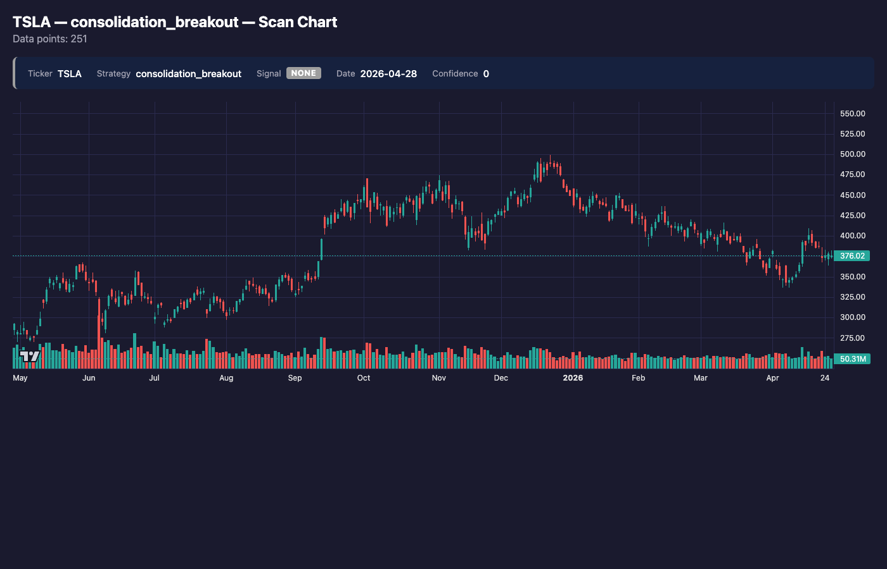

# Strategies Guide

Visual reference for the V3 trading strategies. Each chart shows real backtest results with entry/exit markers, consolidation zones, and performance metrics.

---

## Combined V3 Backtest

The `v3` pipeline tunes and backtests both **consolidation_breakout** and **trend_pullback** strategies together, producing a combined chart with markers for each signal type.

### NVDA — Combined Backtest



Green triangles mark **BUY** entries (breakout or pullback), red triangles mark **SELL** exits (stop-loss or target hit). The chart covers ~2 years of daily price action with volume bars below.

### GOOGL — Combined Backtest



Notice how the strategy captures trending moves while stopping out quickly on false breakouts. The performance panel (top) shows win rate, total return, max drawdown, and Sharpe ratio.

### HOOD — Combined Backtest



A more volatile ticker showing how the system adapts parameters to the stock's character. Wider stops on volatile names, tighter on low-beta stocks.

---

## Volume Dry-Up (VDU) Strategy

The VDU strategy detects periods where volume contracts to extreme lows while price consolidates in a tight range. This "calm before the storm" pattern often precedes explosive directional moves.

### AAPL — VDU Backtest



VDU entries fire when volume drops below the threshold while price range compresses. The strategy captures expansion moves that follow extended contraction periods.

### NVDA — VDU Backtest



On a high-momentum name like NVDA, VDU signals tend to align with pauses in a larger trend — the subsequent expansion usually continues in the prevailing direction.

---

## Scan Charts (Signal Overlay)

Scan charts show the **current signal state** overlaid on recent price action (~1 year). They include consolidation zones (shaded rectangles), breakout levels, and the current signal classification.

### GOOGL — Scan Chart



The shaded regions represent detected consolidation zones. The breakout level (horizontal line) marks where price needs to clear with volume to generate an **Active** signal.

### TSLA — Scan Chart



A scan chart in a more volatile context. The system identifies multiple consolidation zones and tracks proximity to breakout, labeling the signal state (none, near, active) in the header.

---

## Strategy Summary

| Strategy | Pattern | Entry Trigger | Typical Hold |
|----------|---------|---------------|--------------|
| Consolidation Breakout | Tight range → expansion | Price clears resistance on volume | 5–20 days |
| Trend Pullback | Uptrend → dip → bounce | Reclaims MA with rising volume | 5–15 days |
| Volume Dry-Up | Volume contracts → expansion | Volume spike after extreme contraction | 5–25 days |
| Bear Breakdown | Downtrend → consolidation → drop | Breaks support on volume (SHORT) | 5–15 days |
| Keltner Mean Reversion | Oversold in uptrend → snap back | Price reclaims lower Keltner band | 3–10 days |
| Post-Earnings Drift | Earnings gap → base → continuation | Tight base breakout after gap | 10–30 days |

---

## How to Generate Your Own Charts

```bash
# Full V3 pipeline (tune + backtest + chart)
npm run v3 -- --ticker AAPL

# Scan chart (signal overlay on recent data)
npm run scan-chart -- --ticker AAPL --strategy consolidation_breakout

# VDU-specific backtest chart
npm run chart -- --ticker AAPL --strategy volume_dry_up
```

Charts are saved as interactive HTML files in `.stock-tracker/` and automatically open in your browser.
